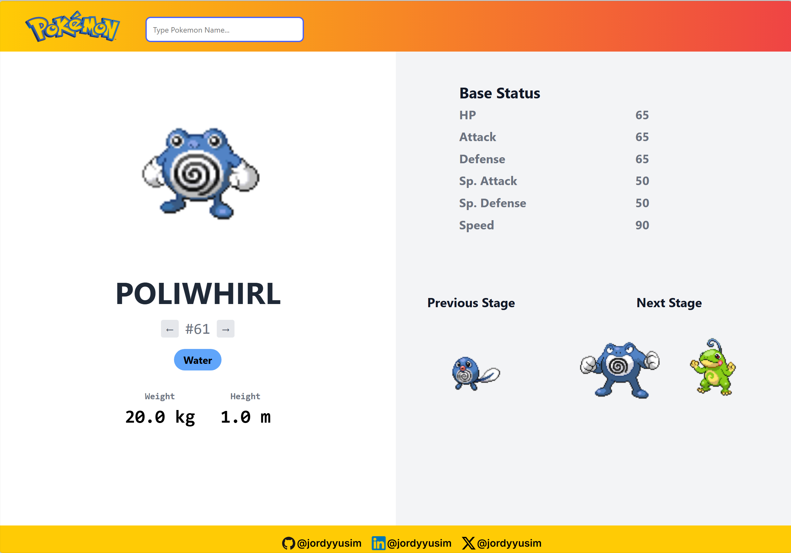

# Pokedex-Pokemon-Finder
A web-based Pokédex app built with **Django** and integrated with the public **PokéAPI**. You can search for any Pokémon, view its base stats, type(s), height/weight, and evolution stages — all in a sleek.

---

## 🌟 Features

- 🔍 Search for Pokémon by name
- 🔄 Navigate pokemon after/before by arrow buttons
- 📊 Display a dynamic type badges and detailed base stats (HP, Attack, Defense, etc.)
- 🧬 Evolution chain: previous and next stages with images
- 🎨 Responsive design with Bootstrap and custom styling
- ⚠️ Error handling for invalid or unknown Pokémon

---

## 🛠️ Built With

- Python
- Django
- HTML/CSS
- PokéAPI (https://pokeapi.co)

---

## 📸 Screenshots





---

## 📦 Installation

```bash
1. Clone the repository
git clone https://github.com/jordyyusim/pokedex-pokemon-finder.git
cd pokedex-pokemon-finder


2. create new environment
python -m venv yourenv
source venv/bin/activate  # On Windows: venv\Scripts\activate


3. install dependencies
pip install -r requirements.txt


4. run the development server
python manage.py runserver


5. Open `http://127.0.0.1:8000/` in your browser
```

---

## 📬 Socials
[GitHub](https://github.com/jordyyusim) &nbsp;|&nbsp;
[LinkedIn](https://linkedin.com/in/jordyyusim) &nbsp;|&nbsp;
[X](https://x.com/jordyyusim)
